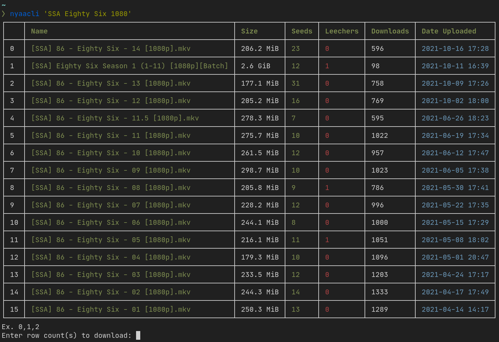

<div align="center">
  <h1>nyaacli</h1>
</div>


## What
CLI client for nyaa written in [Rust](https://www.rust-lang.org/).
This app scrapes nyaa.si website since nyaa does not have any official REST API (AFAIK).

## Why
Just a weekend project for learning rust :-)

## Dependencies
```
rust
xdg-utils
```

## Download
Compiled binaries are available in the releases section.

## Building it yourself
Run
```
cargo build --release --target x86_64-unknown-linux-gnu
```
Binary will be located at
```
target/x86_64-unknown-linux-gnu/release
```
## Usage

### How to search
```
nyaacli 'Anime Name'
```

### Help
```
nyaacli --help
```